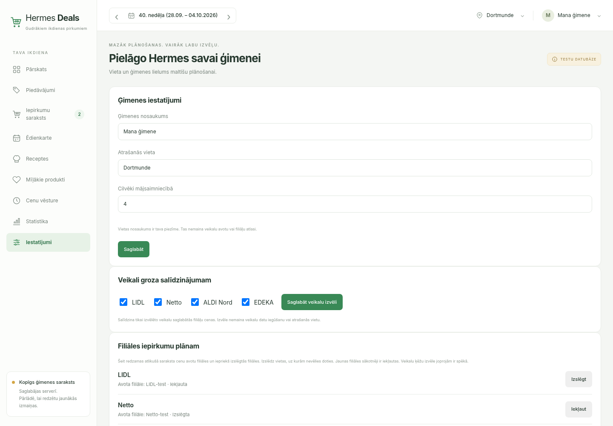
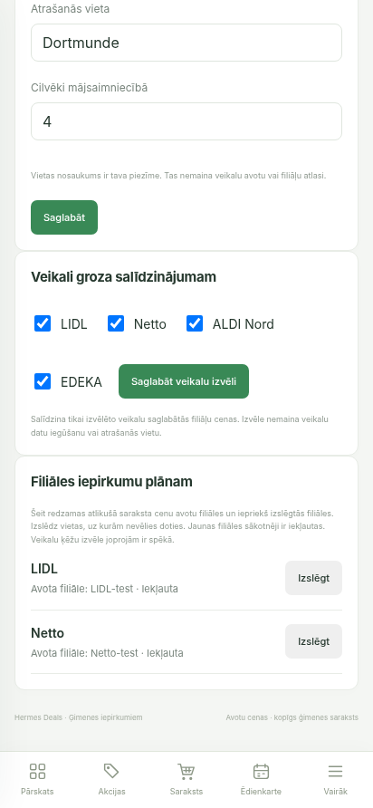

# Individual branch preferences acceptance

2026-10-02. Local isolated SQLite and explicitly labelled synthetic fixtures; no production mutation or claimed new retailer coverage.

Chromium acceptance: exclude Netto-test, save, navigate to the shopping list. The complete two-store plan disappeared and LIDL remained an explicitly incomplete basket; both shopping entries remained. Return to settings: Netto-test stayed excluded. Include it again: the complete €3.50 test plan returned. Desktop 1440×1000 and mobile 412×892 render the light settings and branch buttons.

Focused tests: 50 passed, 1 warning. Regression covers separate branches within one chain, a colon in a source ID, persistence, restoration after clearing the list and rejection of invented branches. Existing CSRF/optimistic concurrency protections remain shared.

Architecture guard and git diff check passed. Initial test invocation needed correction: DATABASE_URL was missing, then APP_ENV=test changed a label expected by existing tests; the full suite also requires the virtualenv bin directory on PATH for subprocesses calling python. These were harness configuration issues; no product changes were made to mask them.

Final full backend regression: **3202 passed, 4 skipped, 3 warnings in 65.37s**. Command: `PATH=<audit-venv>/bin:$PATH DATABASE_URL=sqlite+pysqlite:///:memory: PYTHONPATH=backend python -m pytest backend/tests -q`.
