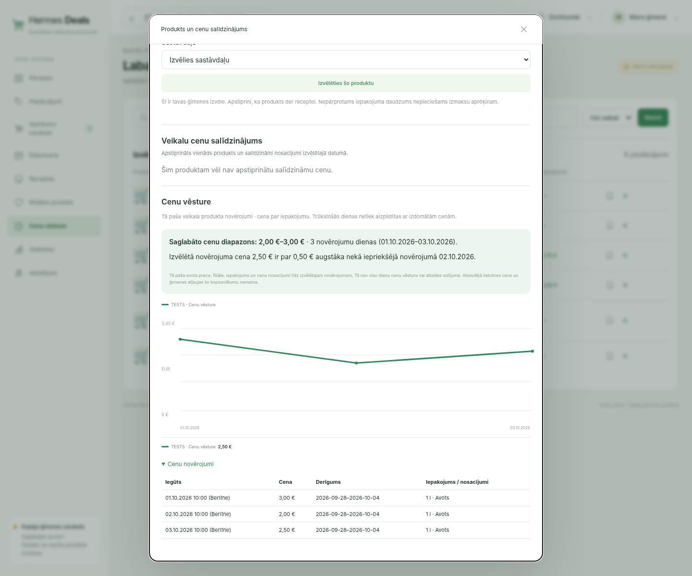

# Price observation summary acceptance

2026-10-03. Isolated local SQLite and synthetic TESTS data, no production mutation.

Chromium 1440×1200: selected €2.50 observation shows the €2–€3 recorded range over three observation days and a €0.50 increase against the previous observed day. The graph and exact source observation table remain visible underneath. This is a factual observation summary, not a claim of an unusually good deal or complete daily market coverage.

The shared Python helper uses the existing exact series boundaries and observations through the selected record's timestamp. Distinct Berlin calendar dates determine coverage. Repeated intra-day snapshots cannot become a previous day; conflicting prices at the latest earlier timestamp suppress the change comparison. Unknown price basis or an unavailable selected observation yields no summary. Separate app prices and household permissions do not rewrite this source-price history. Truncated history is labelled.

Validation: 88 focused tests passed, 2 warnings; full backend suite 3212 passed, 4 skipped, 3 warnings (68.04s). Architecture guard and git diff check passed. Regression tests cover an older selected observation with newer data present, single-day evidence, ambiguous previous prices, changed packages and unknown basis.

