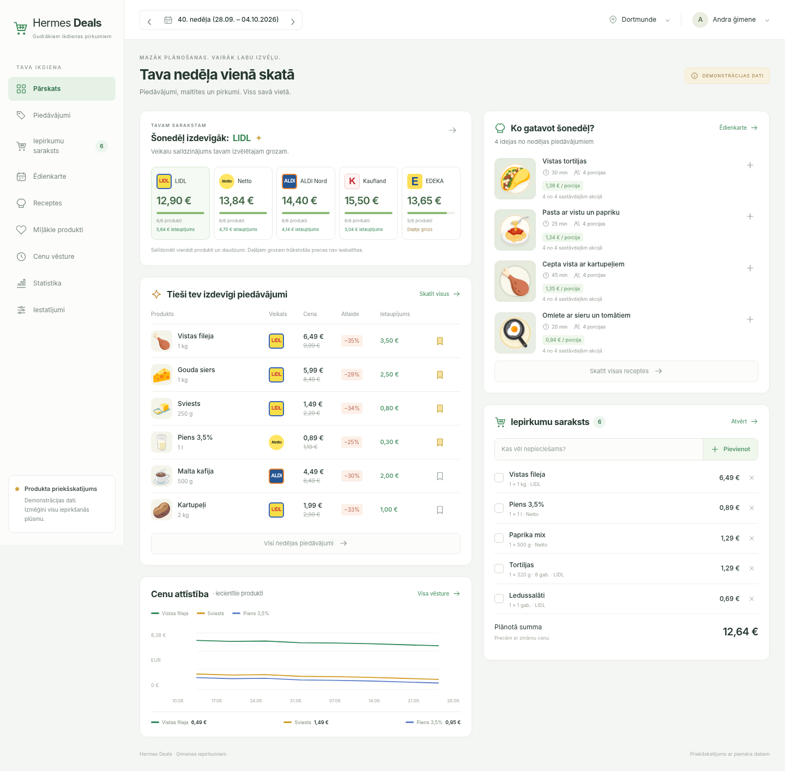
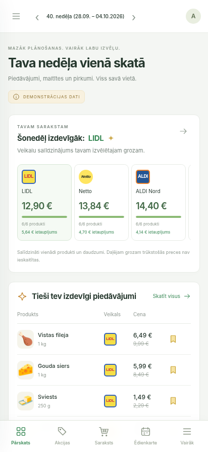
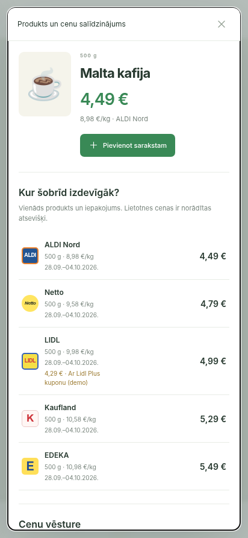

# North-star light UI — local synthetic verification

2026-10-01. Local preview at `127.0.0.1:8766`; no production browser or database.

- Desktop: Chromium, 1440 × 1000 viewport, full-page capture.
- Mobile: Chromium, 412 × 892 viewport.
- Product detail: mobile comparison table and visible close control, no horizontal clipping.
- Browser actions checked: recipe ingredients → shopping list; mobile menu; product detail; Escape; reset demonstration.
- Automated preview workflow: **15 passed**, all nine views at three dates, including dates without offers, CSRF, isolated sessions, escaped free text, list edits, favorites/search, week-scoped plan, household portions, basket coverage and totals.
- Combined source checkout backend regression: **3134 passed, 5 skipped**. The base CI environment has no Jinja; preview tests were run separately in the preview environment. The remaining skipped tests require optional environments.
- Frontend: **61 passed**, `npm run build:check` passed. New endpoint regression: **16 passed** (included in backend total).

Screenshots contain deliberately synthetic prices and placeholder food illustrations. They establish presentation and interaction only, not retailer data freshness or production rollout.

