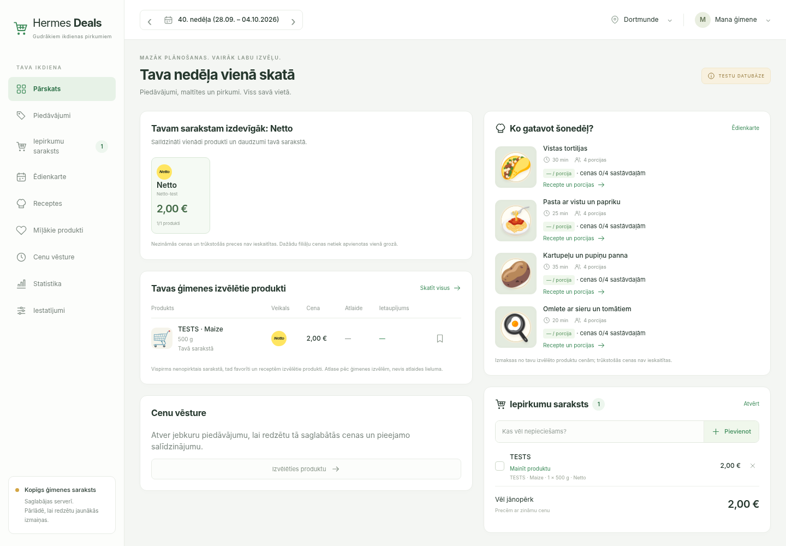

# Explicit household offer selection

2026-10-03. Local SQLite test fixtures, no production or new retailer coverage claim.

Overview displays at most six current products explicitly chosen by the household: unchecked manual list items, then favorites, then selected recipe ingredients. Duplicate latest observation IDs merge their reasons. Selection does not depend on catalogue pagination and does not infer preferences from browsing. Expired and future-collected observations are excluded. With no eligible choices, the overview explicitly explains its general catalogue fallback.

Chromium desktop 1440×1000: the bound TESTS · Maize offer appears with “Tavā sarakstā”, beside the basket, recipes and shared list. Source price and provenance behavior remain unchanged. The catalogue link opens all offers, not a claimed full personal ranking.

Focused tests: 68 passed, 2 warnings. Full backend regression: 3210 passed, 4 skipped, 3 warnings (69.08s). Architecture guard and diff check passed. Tests cover ordering, merged reasons, independence from catalogue pagination and exclusion of expired/future/purchased-only entries. The screenshot predates a final link-label clarification from “Skatīt visus” to “Visi piedāvājumi”.

