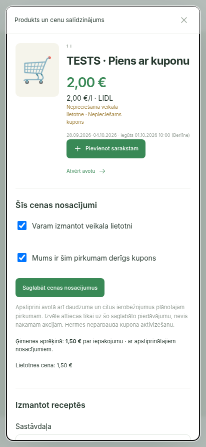

# Price eligibility acceptance

2026-10-02. Isolated local SQLite; screenshot contains explicitly synthetic test offers, not retailer coverage evidence. No production changes.

Chromium 412×892: offer details initially show unknown household price for an offer requiring both app and coupon. Check both boxes and save; redirect preserves the same product detail. Stored checkboxes remain checked, household price becomes €1.50, source price stays €2.00 and conditions remain visible. Removing the coupon confirmation restores the unknown household price.

- Focused live UI, preview and basket tests: **69 passed**, 2 warnings.
- Full backend regression: **3206 passed, 4 skipped**, 3 warnings, 86.28s.
- Architecture guard and whitespace diff check: passed.
- Tests cover separate confirmations, revocation, app validity, non-transfer to a newer observation, unchanged history, measured recipes, unsupported quantity basis and per-offer approval in canonical comparisons.

Test command uses the audit virtualenv bin directory on PATH, `DATABASE_URL=sqlite+pysqlite:///:memory: PYTHONPATH=backend python -m pytest backend/tests -q`.

