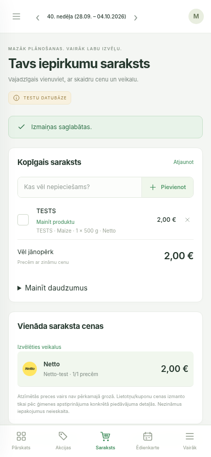

# Shopping intent acceptance

2026-10-03. Local SQLite synthetic fixtures, explicitly marked TESTU DATUBĀZE. No production change or live retailer coverage claim.

Chromium: an existing free-text TESTS list entry had unknown price. Clicked Atrast piedāvājumu, opened the TESTS · Maize result, selected the existing entry in the offer detail and submitted Izvēlēties šai rindai. Redirect returned to the list with one entry, its original name, chosen product/package/source, €2.00 total and complete one-branch basket. Mobile viewport 412×892 inspected visually.

Focused tests: **71 passed**, 2 warnings. Full backend suite: **3208 passed, 4 skipped**, 3 warnings (78.73s). Regression checks preserve row ID, name, quantity and cardinality across initial binding and replacement, reject purchased/meal rows and invalid offers, and assert no canonical identity links are created. Architecture guard and diff check passed.

Full test command: `PATH=<audit-venv>/bin:$PATH DATABASE_URL=sqlite+pysqlite:///:memory: PYTHONPATH=backend python -m pytest backend/tests -q`.

