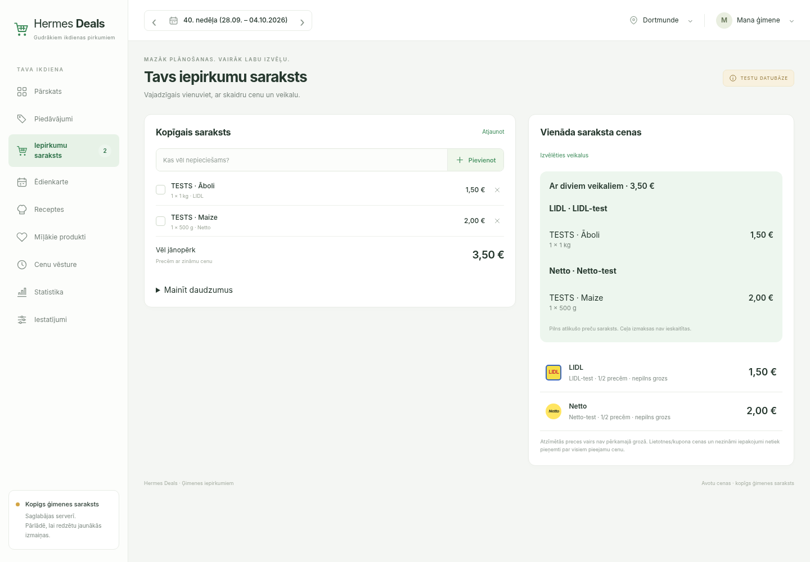
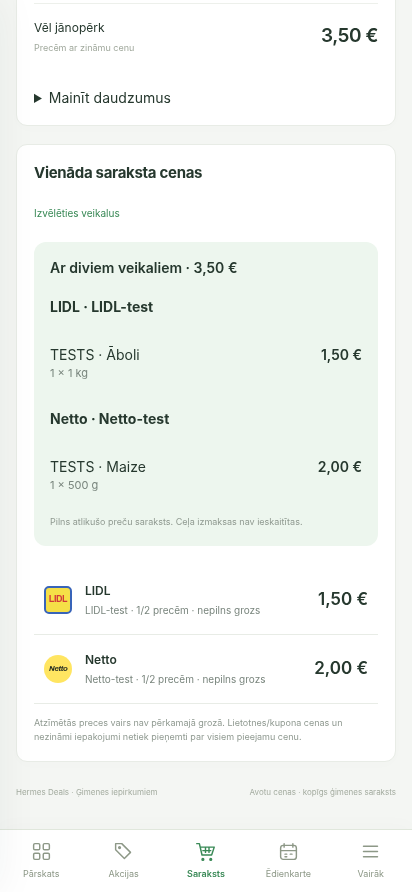

# Store preferences and two-store plan acceptance

2026-10-02, local SQLite acceptance database; all pictured products and prices are explicit synthetic test fixtures, not retailer evidence. No production database, collector, migration or deployment was changed.

- Chromium desktop 1440×1000 and mobile 412×892: light stylesheet renders; complete basket is grouped by evidenced test branch, with package counts and offer links.
- Settings: unchecked Netto and saved through the real browser form. After navigation/reload, Netto stayed unchecked and the two-store plan disappeared; the remaining LIDL basket was explicitly incomplete.
- Checked Netto and saved again. The complete two-branch plan returned (€3.50), without fabricated savings against a nonexistent complete single-store basket.
- Focused backend tests: 64 passed, 2 warnings.
- Final full backend regression: 3201 passed, 4 skipped, 3 warnings (71.14s).
- Web architecture guard and git diff whitespace check passed.
- Browser inspection caught an overwritten stylesheet before delivery. Restored the original CSS plus the intended additions; an HTTP asset regression now rejects template content served as CSS.

